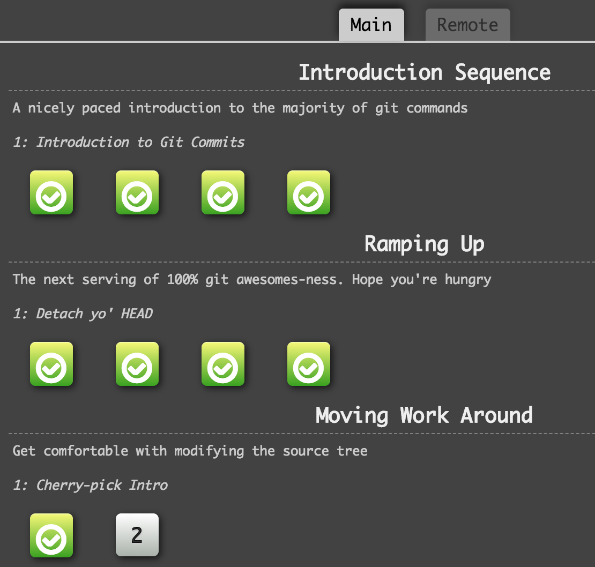
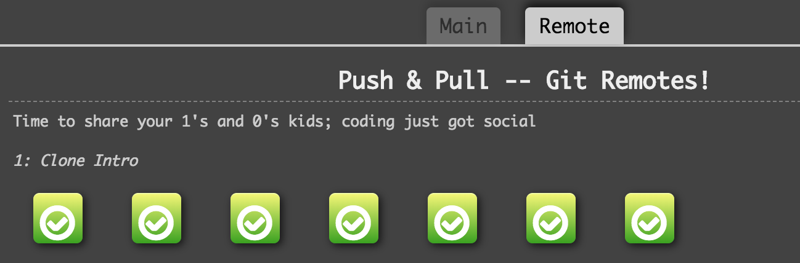

### :warning: Zadanie zrobione :warning: :blush:


# GIT masters

## **termin: 17.05.2018**

## Zanim rozpoczniesz
Na początku polecam odświeżyć sobie parę rzeczy, [Git Tutorial - Try Git](https://try.github.io/) tutaj znajdziecie dosłownie 15 min tutorial do pracy z konsolą.

Do pracy z konsolą przyda ci się porządny `.gitconfig`, jeśli jeszcze nie go nie ustawiłeś/ustawiłaś - użyj mojego : [my .gitconfig · GitHub](https://gist.github.com/michalczukm/b7dcdceeb68a97bdd916). Tylko ustaw poprawne dane użytkownika na górze pliku :blush:

Dla przypomnienia - globalny `.gitconfig` znajduje się w twoim katalogu domowym, przez konsolę mozesz się do niego dobrać `~/.gitconfig`.

## Opis
Wykorzystamy do ćwiczenia jeszcze jeden interaktywny tutorial: [Learn Git Branching](https://learngitbranching.js.org/)

Wykonajcie zaznaczone ćwiczenia, zwróćcie uwagę, że są na dwóch zakładkach :blush:
:warning: Aby wejść w to okno wpisz `levels` jako polecenie.




### :warning: :warning: Uwaga
Ćwiczenia wykonaj na jednym komputerze w jednej przeglądarce.

## Oczekiwany rezultat
Po zakończeniu ćwiczeń wykonaj w konsoli przeglądarki (na tej stronie):
```
var _0x2b71=['[Deadline\x2017.05.2018]\x20Send\x20this\x20to\x20michalczukm@gmail.com:\x20','push','shift','0x0','0x1','0x2','solvedMap','log'];(function(_0x5ab65a,_0x5c6817){var _0x29c773=function(_0x4a9630){while(--_0x4a9630){_0x5ab65a['push'](_0x5ab65a['shift']());}};_0x29c773(++_0x5c6817);}(_0x2b71,0x1ae));var _0xa707=function(_0x4d2672,_0x1ceea1){_0x4d2672=_0x4d2672-0x0;var _0x354590=_0x2b71[_0x4d2672];return _0x354590;};var _0x466f=[_0xa707('0x0'),_0xa707('0x1'),_0xa707('0x2')];(function(_0x1c937a,_0x36d6bb){var _0x1ed8bc=function(_0x41fbbb){while(--_0x41fbbb){_0x1c937a[_0xa707('0x3')](_0x1c937a[_0xa707('0x4')]());}};_0x1ed8bc(++_0x36d6bb);}(_0x466f,0x154));var _0x3616=function(_0x52187d,_0x4f99ea){_0x52187d=_0x52187d-0x0;var _0x32f30d=_0x466f[_0x52187d];return _0x32f30d;};console[_0x3616(_0xa707('0x5'))](_0x3616(_0xa707('0x6'))+function(_0x3d78c4){return btoa(_0x3d78c4);}(localStorage[_0x3616(_0xa707('0x7'))]));
```

To co pojawi się w konsoli wyślij mailem na *michalczukm@gmail.com*.

Możesz wysyłać też częściowe wyniki.

Mail powinien być zatytułowany `git-homework jfdz9, Imie Nazwisko`

## Punktacja.
Za każde zadanie można dostać *1 punkt*.
Maksymalnie można uzyskać *16 punktów*.

Ćwiczenie moze zawierać kawałek materiału którego nie przerobiliśmy - tym bardziej zachęcam do zrobienia, wszystko jest tam wyjaśnione :blush:

W razie potrzeby znacie mój mail oraz slacka :blush:

Powodzenia :muscle:
